# Fashion Visual Similarity Search

PyTorch implementation of a visual similarity search engine for fashion – fine-tuned ResNet50 embeddings + FAISS indexing, evaluated across 13 style categories on 34,849 images.

## Demo

**Dresses – baseline vs full fine-tune (query → top-5 results):**

Baseline:


Fine-tuned:
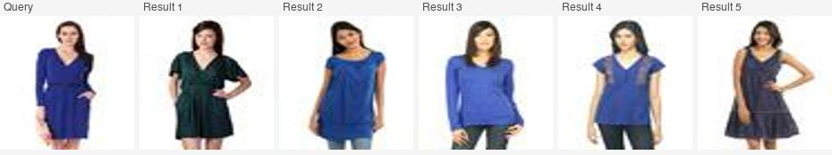

More retrieval grids across all 5 query classes (Tshirts, Heels, Jeans, Sunglasses, Dresses):

| | Baseline | Fine-tuned |
|---|---|---|
| Tshirts | 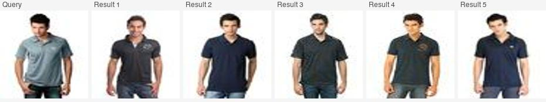 | 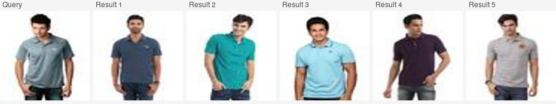 |
| Heels | 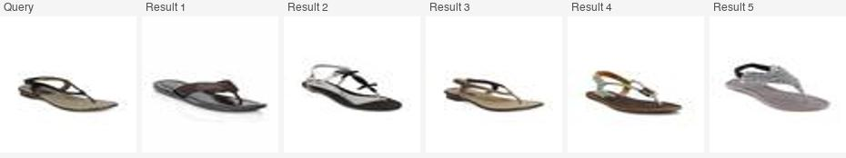 | 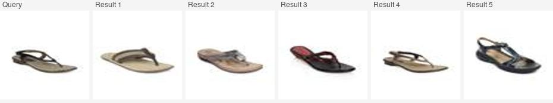 |
| Jeans | 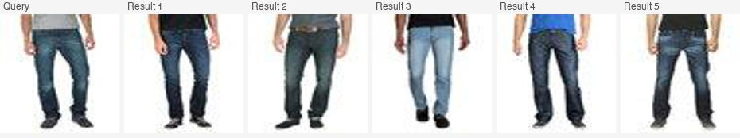 | 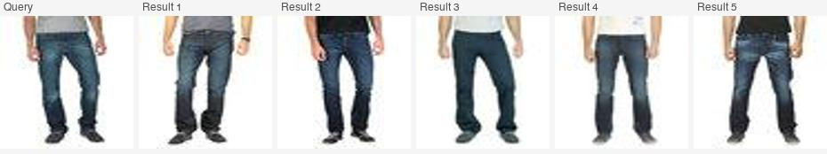 |
| Sunglasses | 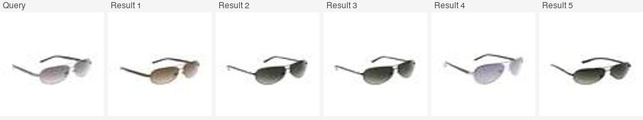 | 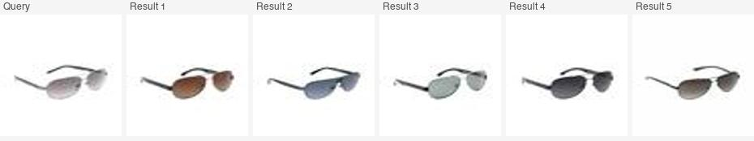 |
| Dresses | 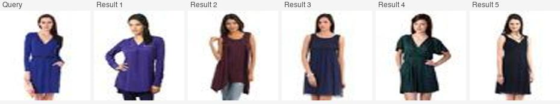 |  |

**Gradio demo (local):**
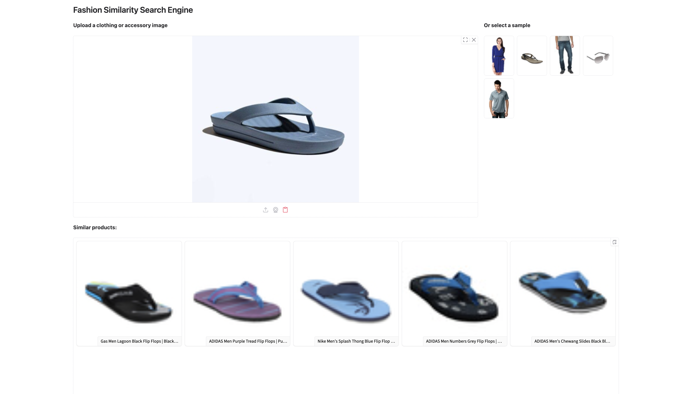

> **Note:** works best with product-style images (white/light background, single item centered). See [Limitations](#limitations) for why.

**Running the demo locally:** a Gradio frontend is available (`src/app.py`) but is not hosted publicly — queries run against a FAISS index of all 34,849 images, and serving that index alongside the full image dataset isn't practical on free hosting tiers. See Setup below.

## Results

### Baseline vs Full Fine-Tune (Flat Index, P@5)

| Category | Base P@5 | FT P@5 | Delta |
|----------|---------:|-------:|------:|
| same_article_type | 0.940 | 0.920 | -0.020 |
| same_color | 0.480 | 0.460 | -0.020 |
| same_gender | 0.780 | 0.880 | +0.100 |
| footwear | 1.000 | 0.920 | -0.080 |
| outerwear | 0.480 | 0.460 | -0.020 |
| tops | 1.000 | 1.000 | +0.000 |
| bottom_wear | 1.000 | 1.000 | +0.000 |
| accessories | 1.000 | 0.880 | -0.120 |
| bags | 1.000 | 0.980 | -0.020 |
| jewelry | 1.000 | 1.000 | +0.000 |
| innerwear | 0.940 | 0.960 | +0.020 |
| casual_wear | 0.820 | 0.840 | +0.020 |
| dresses | 0.700 | 0.860 | **+0.160** |
| rare_class | 0.820 | 0.840 | +0.020 |
| **MEAN** | **0.854** | **0.857** | **+0.003** |

The mean delta (+0.003) undersells the improvement – 6 of 14 categories were already at P@5 = 1.00 at baseline and had no room to move, compressing the mean. The signal is in the categories that had headroom: `dresses` +0.160, `same_gender` +0.100.

- **Improvements from full fine-tuning:** frozen backbone fine-tuning improved classification accuracy (82.2% → 88.9%) but didn't move the embedding space – only the classification head weights changed. Full end-to-end fine-tuning actually shifted the backbone features: same-class L2 went from 8.06 → 12.92, and the `dresses` category (which baseline consistently confused with Tops) improved by 16%.
- **Identified limitations:**
    - `same_color` (P@5 = 0.480): color-based retrieval is a known weakness of classification-pretrained embeddings – the model learns *what* something is more strongly than *what color* it is
    - `outerwear` (P@5 = 0.480): Jackets/Sweaters/Sweatshirts are visually similar to each other but also to Shirts/Tops, so the category boundaries are soft
    - `accessories` dropped post fine-tuning (-0.120): the fine-tuned model retrieves very close matches at top-1 but the 4th/5th results are less diverse – a known tradeoff of fine-tuning toward tighter clusters

### Flat vs Approximate Index (Baseline Embeddings)

| Index | Mean P@5 | Avg Latency |
|-------|---------:|------------:|
| IndexFlatL2 (exact) | 0.854 | ~6.00 ms |
| IndexIVFFlat nlist=100, nprobe=10 (approximate) | 0.854 | ~0.92 ms |
| **Speedup** | **0% precision loss** | **~6.5× faster** |

At 34,849 vectors with nprobe=10 (10% of cells searched per query), IVF matches exact search with 0% precision loss. The speedup becomes more dramatic at larger index sizes – this tradeoff is the main motivation for approximate indexing in production.

## Limitations

The model was fine-tuned entirely on Myntra product photography – white/light backgrounds, single item centered, consistent studio lighting. On editorial or in-the-wild images, the ResNet backbone extracts features from the full scene (background, lighting, pose) rather than the garment itself, and retrieval breaks down.

The fix is a garment detection/segmentation step before embedding (YOLO or SegFormer to crop the item first) – the natural next step for real-world input.

## Architecture

Images are passed through a ResNet50 backbone (pretrained on ImageNet, fine-tuned on 34,849 fashion product images) with the classification head replaced by an identity layer, producing 2048-dimensional feature vectors. Vectors are L2-normalized and stored in a FAISS index for nearest-neighbor retrieval.

```
query image → ResNet50 backbone → 2048-d embedding → L2 normalize → FAISS search → top-k results
```

**Two training modes:**
- **Frozen backbone:** only the classification head is trained (`lr=1e-3`). Fast convergence, 82.2% val accuracy, but the convolutional features never change – so embeddings don't improve for retrieval.
- **Full fine-tune:** entire backbone trained with differential learning rates (backbone `lr=1e-5`, head `lr=1e-4`), starting from the frozen-backbone checkpoint. 88.9% val accuracy, embedding clustering improves, retrieval quality improves on weaker categories.

**Two index types:**
- **IndexFlatL2:** exact brute-force search. Accurate, scales O(n) with index size.
- **IndexIVFFlat:** approximate search via inverted file index. Clusters vectors into `nlist` cells; queries search only `nprobe` nearest cells. Configurable speed/accuracy tradeoff.

## Dataset

- **Source:** [Fashion Product Images (small)](https://www.kaggle.com/datasets/paramaggarwal/fashion-product-images-small) – Kaggle, paramaggarwal
- **After filtering:** 34,849 images, 34 classes
- **Filtering decisions:** dropped non-Western fashion categories (Sarees, Kurtas, Kurtis, Tunics, Nightdress), cosmetics/grooming, and classes with fewer than 150 images
- **Split:** 80/20 train/val, stratified by class

## Project Structure

```
src/
  dataset.py        data loading, filtering, FashionDataset class
  embeddings.py     ResNet50 feature extraction, cluster sanity check
  train.py          fine-tuning: frozen backbone and full fine-tune modes
  faiss_index.py    FAISS index building, visual query function
  benchmark.py      13-category benchmark definition, ground truth functions
  eval.py           precision@k scoring across all benchmark categories
data/
  benchmark_queries.json    fixed benchmark query set (130 queries, 13 categories)
results/
  eval_baseline_full.json
  eval_finetuned_full.json
  eval_baseline_full_ivf.json
notebooks/
  checks/grids/     stitched retrieval grids – query + top-5 results
```

## Setup

```bash
git clone https://github.com/uma-menon/fashion-similarity-search.git
cd fashion-similarity-search
python -m venv venv && source venv/bin/activate
pip install -r requirements.txt

# download dataset (requires Kaggle API token)
kaggle datasets download -d paramaggarwal/fashion-product-images-small -p data/
unzip data/fashion-product-images-small.zip -d data/

# build full-dataset embeddings and index (~35 min on CPU)
python src/embeddings.py      # USE_FULL = True
python src/faiss_index.py     # USE_FULL = True, USE_FINETUNED = False, INDEX_TYPE = "flat"

# run eval
python src/eval.py

# run the Gradio demo (http://127.0.0.1:7860)
python src/app.py
```

## Training

```bash
# frozen backbone (~2 hrs CPU / ~20 min GPU)
# set FULL_FINETUNE = False in src/train.py
python src/train.py

# full fine-tune (~45 min on Colab T4, recommended)
# set FULL_FINETUNE = True in src/train.py
python src/train.py
```

After training, re-embed and re-index:

```bash
python src/reembed_fulltune.py    # generates embeddings_full_finetuned.pt
python src/faiss_index.py         # USE_FULL = True, USE_FINETUNED = True
```